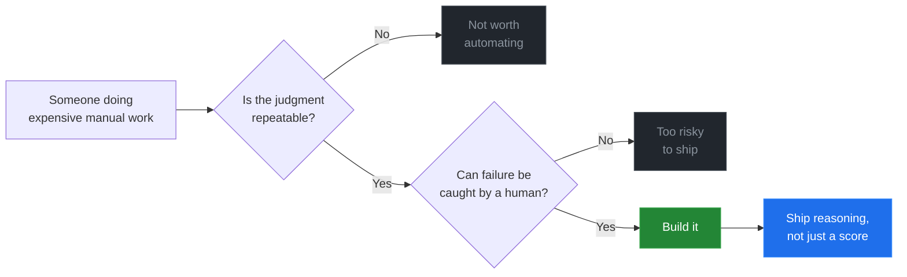
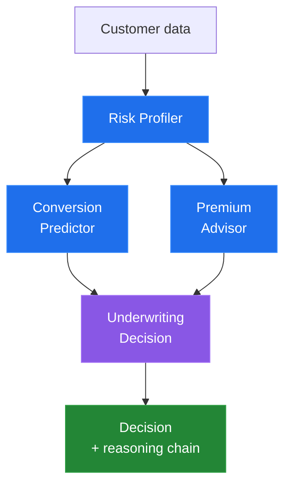
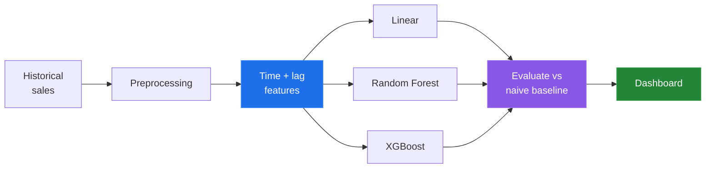
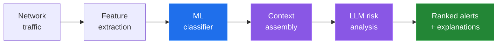
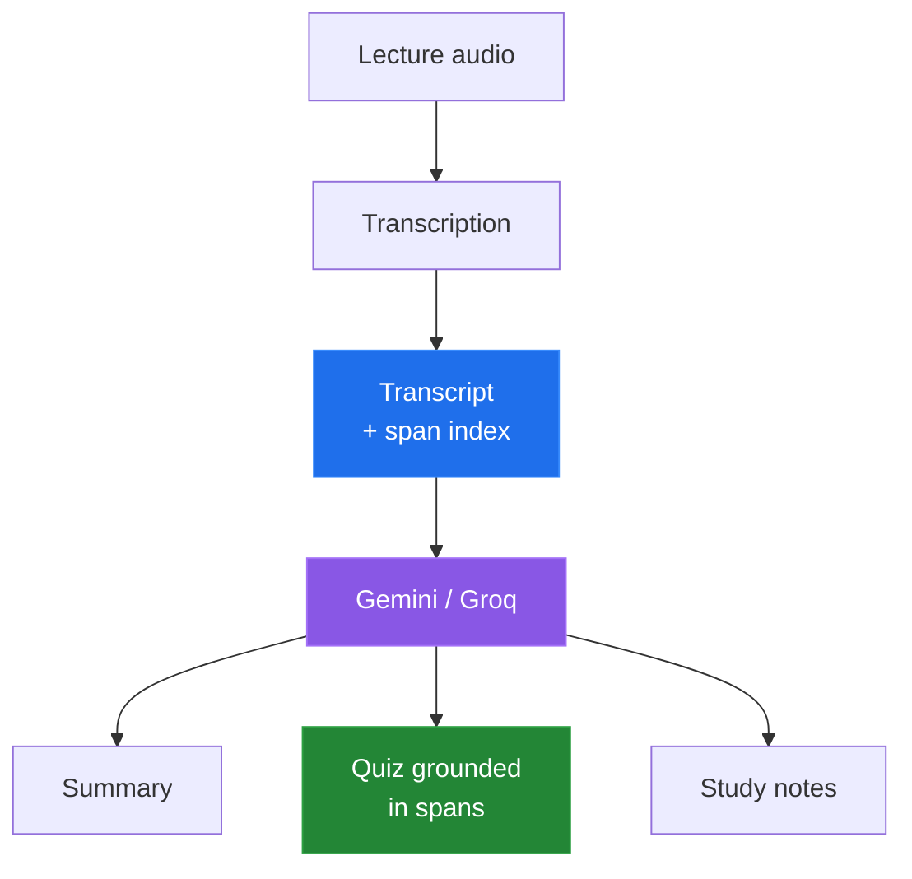

<div align="center">

# `ROHITH PRASAD VAGU`

**I build systems for work that's currently done by hand.**

`Agentic AI` · `Applied ML` · `Backend Systems` · Hyderabad, India

<a href="https://linkedin.com/in/Rohith-Prasad-Vagu">

</a>


</div>

---

```
┌──────────────────────────────────────────┐
│  rohith@systems:~$ whoami                │
├──────────────────────────────────────────┤
│  B.Tech CSE · GITAM · Hyderabad          │
│  AI/ML Engineer                          │
│                                          │
│  Building : agents, pipelines, backends  │
│  Chasing  : reliability, not novelty     │
└──────────────────────────────────────────┘
```

> [!NOTE]
> I don't start from a model and look for a use. I start from a workflow where
> someone makes repeated judgment calls under pressure — an underwriter pricing a
> policy, a planner guessing next month's demand, an analyst reading the four
> hundredth alert of the day — and ask whether a system can carry part of that
> load reliably enough to be trusted.

---

## How I pick what to build



---

## Selected systems

Each project is marked with how far it actually got. I'd rather you know which
of these is load-bearing and which is a sketch.

`🟢 real users` &nbsp; `🟡 working prototype, evaluated` &nbsp; `⚪ study`

<br>

<details open>
<summary><b>🟡 &nbsp;InsureAI</b> — decision support for insurance underwriting</summary>

<br>

**The problem.** Underwriting means holding four judgments at once: how risky is
this applicant, will they convert, what premium clears both, does this pass
policy. Junior underwriters answer these sequentially, inconsistently, and the
reasoning rarely gets written down.

**What I built.** Four agents, each owning one question, passing structured state
forward. The output isn't a score — it's a decision with its reasoning chain
attached, which is the part a human reviewer actually needs.



**Where it stands.** Evaluated on ⟨dataset, size⟩. ⟨Key result — e.g. conversion
AUC, or agreement rate with held-out human decisions⟩. Not deployed against live
policy data.

`Python` `scikit-learn` `multi-agent orchestration` `Streamlit` `Plotly`

**[→ Repository](https://github.com/Rohithprasad-4/insureai-dashboard)**

</details>

<details>
<summary><b>🟡 &nbsp;Sales Forecasting</b> — demand planning without a data team</summary>

<br>

**The problem.** Small retailers plan inventory on gut feel, because every
forecasting tool assumes you have an analyst. Over-order and capital sits on a
shelf; under-order and the sale goes to the shop next door.

**What I built.** Raw sales in, forecast out, with zero feature engineering asked
of the user — temporal and lag features generated automatically, three model
families compared, the winner surfaced through a dashboard a non-technical person
can operate.



**Where it stands.** ⟨MAE/MAPE on held-out period, against a
last-month-repeats baseline — the baseline comparison is the number that
matters⟩. Live demo deployed.

`Python` `XGBoost` `pandas` `scikit-learn` `Streamlit`

**[→ Repository](https://github.com/Rohithprasad-4/sales-forecasting-ml)** ·
**[→ Live demo](⟨url⟩)**

</details>

<details>
<summary><b>🟡 &nbsp;AI Network Security Gateway</b> — triage for alert fatigue</summary>

<br>

**The problem.** Security teams drown in alerts. The bottleneck isn't detection,
it's the analyst deciding whether flagged connection #400 today matters.

**What I built.** An ML classifier on traffic features, paired with an LLM layer
that writes the risk explanation an analyst would otherwise reconstruct by hand.
The context engineering is the hard part — enough network state for the model to
be right, not so much that it invents a threat.



**Where it stands.** ⟨Detection performance on ⟨dataset⟩, and — more usefully —
false positive rate, since that decides whether anyone would actually run this⟩.

`Python` `machine learning` `LLM integration` `network analytics`

**[→ Repository](https://github.com/Rohithprasad-4/AI-Network-Security-Gateway)**

</details>

<details>
<summary><b>🟡 &nbsp;NeuroNote</b> — turning lectures into something you can revise from</summary>

<br>

**The problem.** A recorded lecture is nearly useless for revision. You can't
scan it, search it, or test yourself against it, so students re-watch at 2× and
retain very little.

**What I built.** Audio in; transcript, summary and quiz out. Quiz generation was
the interesting constraint — questions have to target what was actually taught,
not what sounds plausible about the topic, so generation is grounded in
transcript spans rather than left to free-associate.



**Where it stands.** ⟨Lectures processed / whether anyone besides you has used it
— if classmates used it, say so; that's the strongest line here⟩.

`Python` `Gemini API` `Groq API` `FastAPI` `Flask`

**[→ Repository](⟨url⟩)**

</details>

<details>
<summary><b>⚪ &nbsp;Diabetic Retinopathy Detection</b> — where four architectures break down</summary>

<br>

Screening programs must grade retinal images at a volume that outstrips the
ophthalmologists available. I benchmarked CNN, ResNet, EfficientNet and ViT on
five-class severity grading to find where each fails — particularly the middle
grades, where the visual difference between stages is subtle and the class
imbalance is worst.

This one is a study, not a system. The failure analysis taught me more than the
accuracy number did.

`Python` `PyTorch` `Hugging Face Transformers`

**[→ Repository](⟨url⟩)**

</details>

---

## What I'm working through right now

> [!TIP]
> Open questions I don't have clean answers to. If you've solved any of these
> properly, I'd like to hear about it.

- **Agent reliability.** One agent's confident wrong output becomes the next
  agent's premise. Where do validation gates go without turning the pipeline into
  a pile of if-statements?
- **Evaluating generated output.** Accuracy is easy. Judging whether an
  explanation is *faithful* to the model that produced the decision is not.
- **Notebook → service.** Schema drift, retraining triggers, and what to log so
  a failure is diagnosable a week later.

---

## Stack

| | |
|---|---|
| **Reach for first** | Python · FastAPI · PostgreSQL · pandas · scikit-learn |
| **Models** | PyTorch · XGBoost · Hugging Face Transformers · MLflow |
| **LLM work** | Gemini API · Groq API · structured generation · multi-agent design |
| **Also** | SQL · Java · Docker · Git · Streamlit · Plotly |

---

## Experience

**AI/ML Intern** — Sansi RF & Communication Systems · 2026
Multimodal data pipelines, PostgreSQL, MLflow, testing infrastructure.

**AI Engineer Intern** — Chronis (IIT BHU × Sarvam AI) · 2026
Multimodal feature extraction, state management, feature store design.

**Microsoft Learn Student Ambassador**
AI/ML workshops for 500+ students.

<details>
<summary>Competitions & certifications</summary>

<br>

- Smart India Hackathon 2024 — qualified
- BITS Hyderabad Ideathon 2025 — finalist, 700+ participants
- GirlScript Summer of Code 2026 — Open Source & AI/Agents track
- Oracle OCI Generative AI Professional
- Google Responsible AI Certification

</details>

---

<div align="center">

**PERCEIVE → REASON → DECIDE → ACT**

Open to conversations about agentic systems, applied ML and backend
architecture — especially with anyone who has shipped this to production and is
willing to tell me what they got wrong.

<a href="https://linkedin.com/in/Rohith-Prasad-Vagu">LinkedIn</a> · ⟨email⟩

</div>
