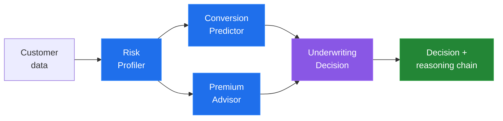

<div align="center">


<br>

**B.Tech CSE @ GITAM · Hyderabad, India**

I build software for work that's currently done by hand.

<br>

<a href="https://linkedin.com/in/Rohith-Prasad-Vagu"></a>
<a href="mailto:⟨email⟩"></a>
<a href="https://github.com/Rohithprasad-4"></a>


</div>

<br>

---

## 🧠 &nbsp;About

```yaml
name:      Rohith Prasad Vagu
role:      AI / ML Engineer
focus:     agentic systems · applied ML · backend
building:  multi-agent pipelines that ship reasoning, not just scores
learning:  AI reliability, retrieval systems, production ML
rule:      if a human can't check the output, it isn't ready
```

- 🤖 &nbsp;I work on **agentic AI** — multi-agent pipelines, decision automation, state-aware workflows
- 🧪 &nbsp;Currently interning across **two AI/ML teams** (multimodal data, feature stores, MLflow)
- 🎤 &nbsp;**Microsoft Learn Student Ambassador** — ran AI/ML workshops for 500+ students
- 🌱 &nbsp;Contributing through **GirlScript Summer of Code 2026**, Open Source & Agents track
- 💬 &nbsp;Ask me about multi-agent design, LLM grounding, or why models die in production

<br>

---

## 🚀 &nbsp;Projects

<div align="center">

| Project | What it solves | Stack | Live | Code |
|:---|:---|:---|:---:|:---:|
| **📈 Sales Forecasting** | Retailers plan inventory on gut feel. Raw sales in → forecast out, no analyst needed. | `XGBoost` `pandas` `Streamlit` | [**▶ Demo**](⟨url⟩) | [Repo](https://github.com/Rohithprasad-4/sales-forecasting-ml) |
| **🧩 InsureAI** | Underwriters juggle 4 judgments at once. A 4-agent pipeline that outputs the *reasoning chain*, not just a score. | `scikit-learn` `Multi-Agent` `Plotly` | [**▶ Demo**](⟨url⟩) | [Repo](https://github.com/Rohithprasad-4/insureai-dashboard) |
| **🛡️ AI Security Gateway** | Analysts drown in alerts. ML classifier + LLM risk explanations, so they read reasoning instead of raw flags. | `ML` `LLM` `Network Analytics` | `soon` | [Repo](https://github.com/Rohithprasad-4/AI-Network-Security-Gateway) |
| **📝 NeuroNote** | Recorded lectures can't be revised from. Audio → transcript, summary, and quizzes grounded in what was taught. | `Gemini` `Groq` `FastAPI` | [**▶ Demo**](⟨url⟩) | [Repo](⟨url⟩) |
| **👁️ Retinopathy Detection** | Screening needs more graders than exist. Benchmarked CNN / ResNet / EfficientNet / ViT on 5-class grading. | `PyTorch` `Transformers` | `study` | [Repo](⟨url⟩) |
| **🎓 Placement Analysis** | Campus placement advice is folklore. Tested what actually predicts an offer and its salary. | `scikit-learn` `pandas` | `notebook` | [Repo](https://github.com/Rohithprasad-4/campus-placement-data-analysis-salary-prediction) |

</div>

<br>

---

## 🛠️ &nbsp;Tech Stack

<div align="center">

**Languages**


**AI / Machine Learning**


**Generative & Agentic AI**


**Backend & Data**


**Tools**


</div>

<br>

---

## ⚙️ &nbsp;How InsureAI works

<div align="center">



</div>

<br>

---

## 📊 &nbsp;GitHub Stats

<div align="center">


<br><br>


</div>

<br>

---

## 🏆 &nbsp;Achievements

<div align="center">

| | |
|:---:|:---|
| 🥇 | **Smart India Hackathon 2024** — Qualified |
| 🥈 | **BITS Hyderabad Ideathon 2025** — Finalist, 700+ participants |
| 🌍 | **GirlScript Summer of Code 2026** — Open Source & AI/Agents track |
| 🎓 | **Microsoft Learn Student Ambassador** — 500+ students trained |
| 📜 | **Oracle OCI Generative AI Professional** |
| 📜 | **Google Responsible AI Certification** |

</div>

<br>

---

## 💼 &nbsp;Experience

<div align="center">

| Role | Organisation | Worked on |
|:---|:---|:---|
| **AI/ML Intern** | Sansi RF & Communication Systems | PostgreSQL · multimodal data · MLflow · testing |
| **AI Engineer Intern** | Chronis — IIT BHU × Sarvam AI | Multimodal features · state management · feature store |
| **Student Ambassador** | Microsoft Learn | AI/ML workshops, 500+ students |

</div>

<br>

---

<div align="center">

### `PERCEIVE → REASON → DECIDE → ACT`

**Building systems, not just demos.**

Open to collaboration on agentic AI, applied ML and backend systems.

<a href="https://www.linkedin.com/in/rohith-prasad-vagu04/"></a>

</div>
